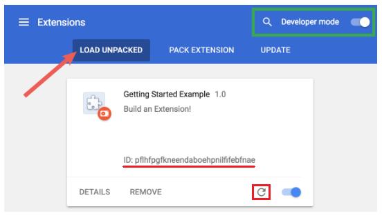

# Tabify

Google Chrome extension for managing tabs
***

## Features
1. Mute all unmuted tabs with Ctrl + Q/Command + Shift + Q
2. Unmute all muted by this extension tabs with Ctrl + Q/Command + Shift + Q
3. Mute/Unmute tabs with Ctrl/Command+Shift+1 when Chrome is not in focus
4. Open all saved web pages with Ctrl/Command + I
***

## Dev Build and Install
1. Run **yarn** in root
2. Run **yarn run build:dev** in root
3. Add the extension in Chrome in **Developer mode**
   1. Open **chrome://extensions** in Chrome
   2. Enable **Developer mode**
   3. **LOAD UNPACKED** extension by choosing the root/dist folder
   4. Copy the **extension ID** from the page
4. Replace the **Tabify.ID** value in Tabify.js with the copied ID
6. Run **yarn run build:dev** in root again
5. **Refresh** the extension in chrome://extensions

